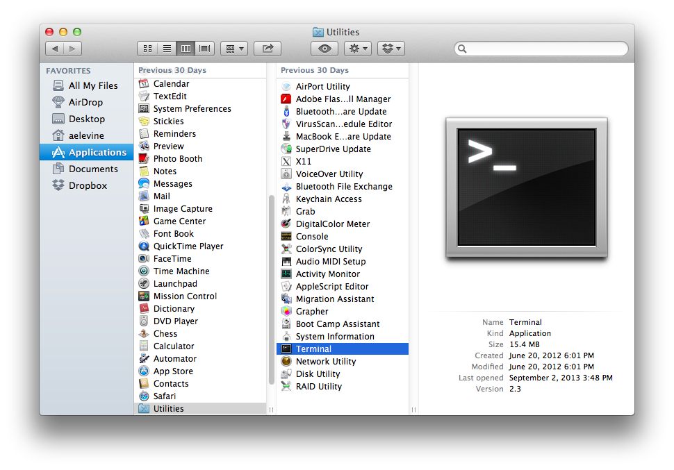
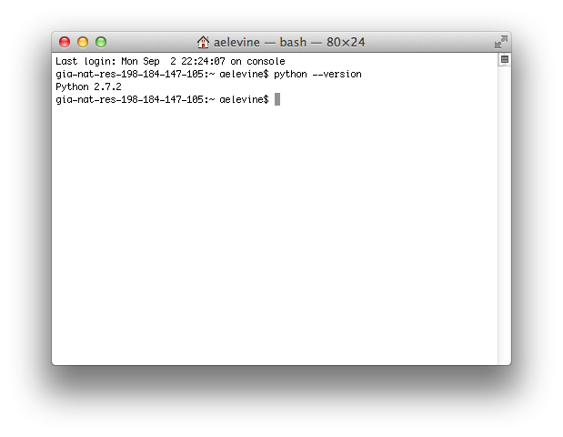
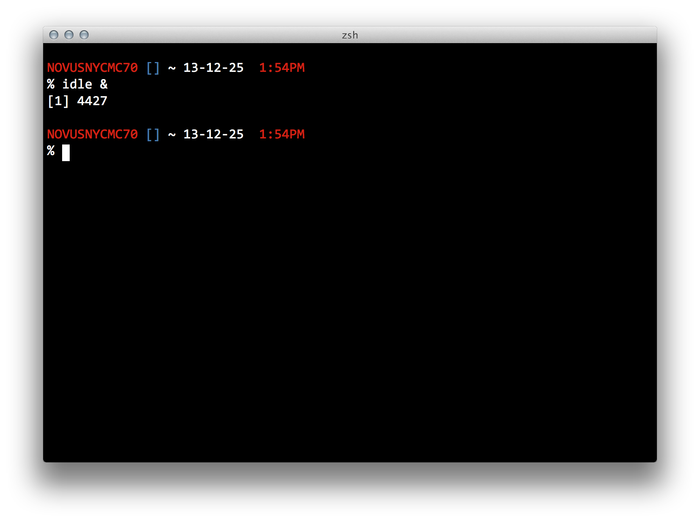
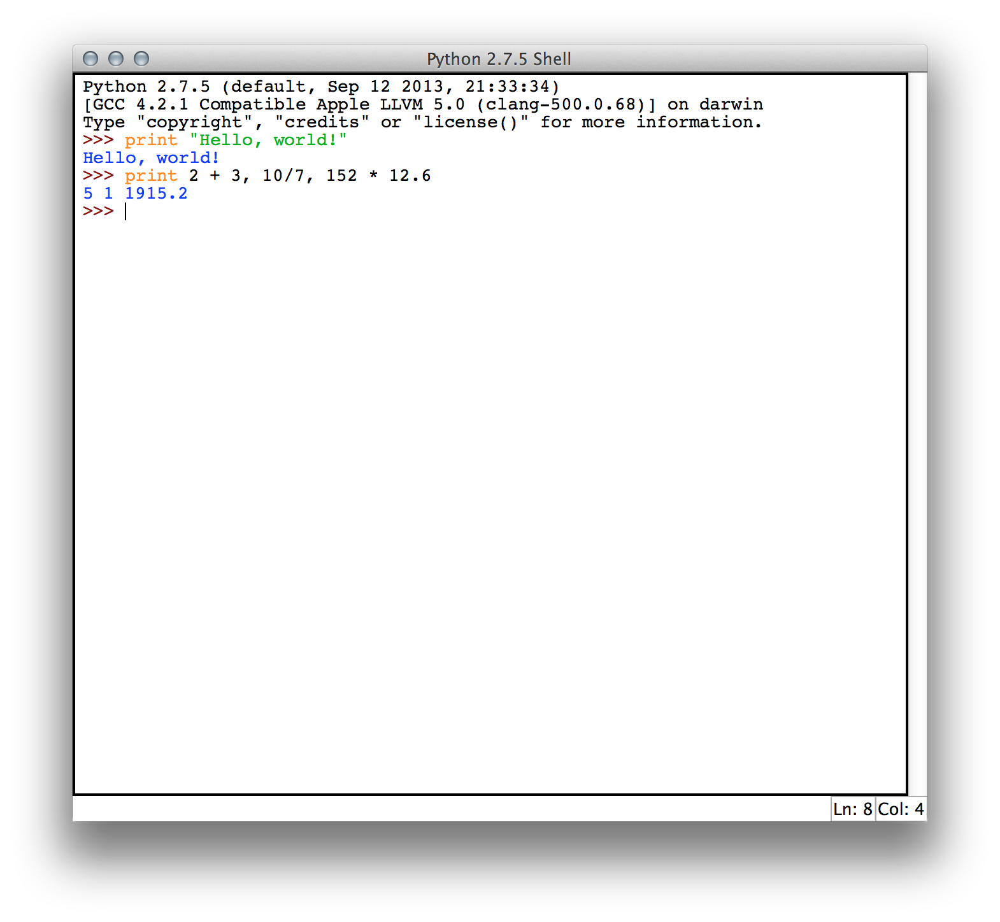
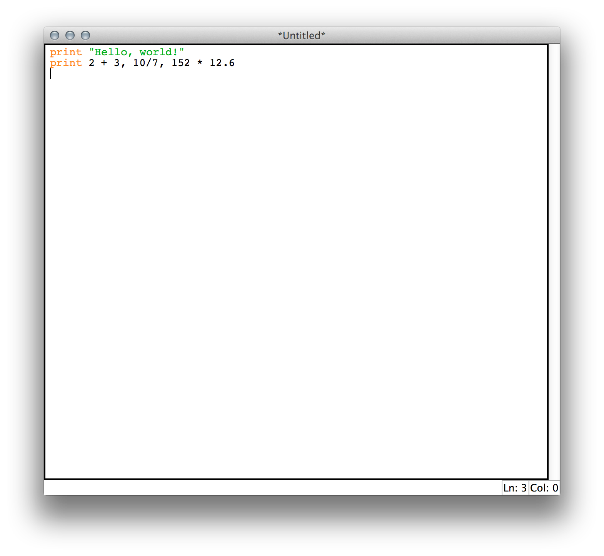
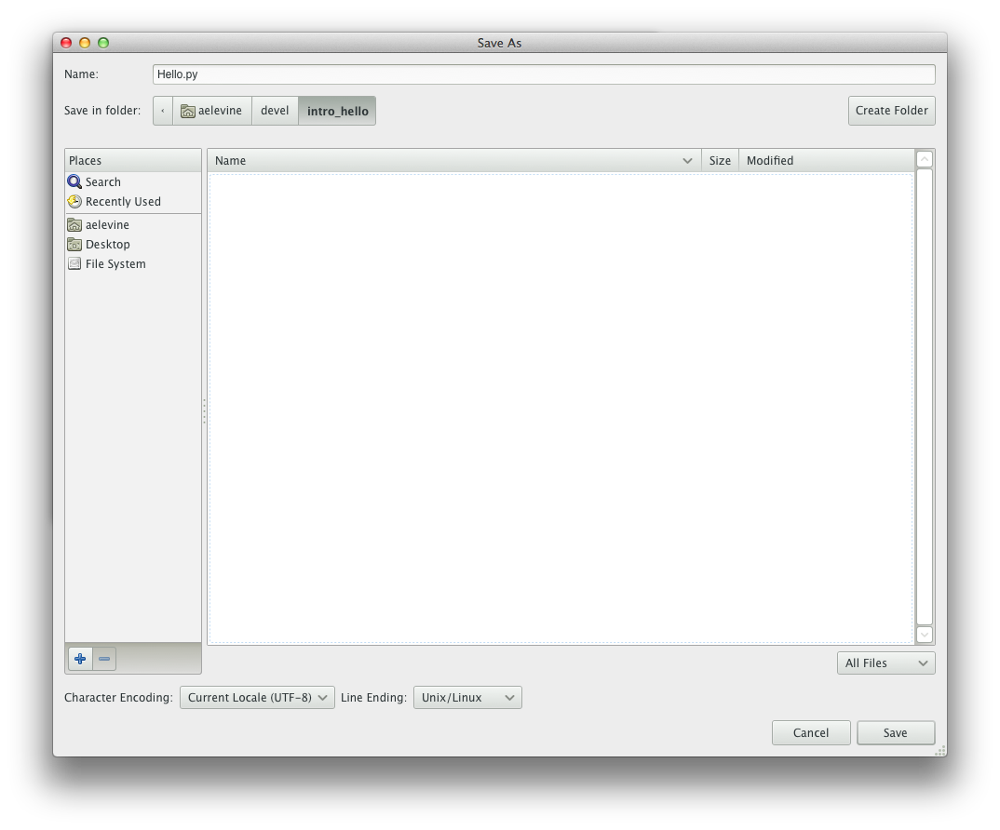

# Introduction

Welcome to the Software Craftsmanship Python examples. These examples will
lead you through a variety of programming exercises in conjunction with the main
Software Craftsmanship lessons. Programming is a skill, and like any other skill,
it takes practice to become truly proficient. The exercises in these examples range
from "monkey-see-monkey-do" problems getting you used to typing exactly as a
computer expects, to free-ranging ideas on programs you might be interested in
writing for yourself. 

You will want to complete every "MSMD" section exactly as written. Computers
are not forgiving when it comes to what you type in your program, and these
exercises are a safe way to begin exploring the world of computer programming.
The exercises for each chapter build on the MSMD section, and are opportunities
for you to apply what you've learned conceptually to a program. You should make
an attempt to complete all the exercises. Finally, projects are larger scale
ideas for programs that you would be able to write with the tools presented by
that point in the main text. The more you program, the better a programmer
you'll be, but you'll probably want to pick and choose projects that interest
you.

## python

Python is included with OSX, and every mainstream Linux distribution. On
Windows, you will need to [download](http://www.python.org/download/) and run
[the installer](https://www.python.org/ftp/python/3.8.0/python-3.8.0-amd64-webinstall.exe).

## First Program

### Terminal

Throughout the book, we will be using an editor and a command prompt almost
exclusively to write and run our programs. A simple command prompt and text
editor offer numerous advantages over other programming setups like
Integrated Development Environments (IDEs) and visual programming tools. All
the reasons stem from the fact that the command prompt is much closer to the
code than any of the other tools allow. While many common operations are
streamlined, knowing how to use the command line effectively is crucial to
overcoming many of the common problems you will encounter in the course of
your programming.

#### Linux

Most newcomers to Linux will be using Ubuntu Linux, so any linux instructions
are for Ubuntu. If you're using a different flavor, the instructions should be
straightforward to cross apply.

The command prompt in Linux is a terminal emulator. In Unity Dash, type Terminal
into the search box and the application will show up. Click it. When the program
launches, you will be prompted to enter a command with a `$ ` character.

Type `python --version`.

You should see `Python 3.8.0`. The last two numbers might be different, but as
long as the version is at least `Python 3.5.0` you will be fine.

#### OSX

OSX includes an app called Terminal. It is either available under Applications /
Utilities, or through Spotlight.



When the program launches, you will be
prompted to enter a command with a `$ ` character.


Type `python --version`.



You should see `Python 3.8.0`. The last two numbers might be different, but as
long as the version is at least `Python 3.5.0` you will be fine.

#### Windows

The windows terminal is a command prompt called 'command' or 'cmd', depending on
your version of Windows. To launch the command prompt in Windows Vista or later,
open the Start Menu, type cmd or command in the search box, and then click the
shortcut.

When it opens, you should see `C:\Users\<your user>\ > `.

Type `python --version`.

You should see `Python 3.8.0`.

### Editor

An editor is a program you'll use to write the source code of your programs.
It's different from a word processor in that only the characters you type go
into the program file. For instance, a word program will have information about
what is a heading, where the tab stops are, and where any tables might be. In
contrast, the text editor only saves the actual letters and tab you'd type. Any
formatting or coloring you see is added after-the-fact, and is not part of the
original source code.

There are numerous code editors available, ranging from free to hundreds of
dollars, and from having almost no features to being able to write significant
portions of your source code and manage large pieces of your program for you. We
are going to choose a free editor with many nice features, but one that still
makes you handle most of the programming yourself. Managing your project on your
own will help you be a better programmer later.

We'll use [idle](http://en.wikipedia.org/wiki/IDLE_(Python)) as our text editor.
It's part of Python, and should be included by default with your python
installation. To open idle, in your terminal, type `idle &`.



*Why can't I just use TextEdit on a mac or Notepad on Windows?* You could, but
neither of those programs have any tools to help you program. Most importantly,
neight has syntax highlighting. Idle will color different parts of your code
neatly, allowing you to see at a glance important pieces of your program, and
often allows you to catch typing mistakes before you even run the program.

When Idle is first opened, it is in "shell" mode. This means you can type code
and run it immediately. Try that now. Type the following two lines, pressing
enter after each, and seeing what the Python shell does.

```
print "Hello, world!"
print 2 + 3, 10/7, 152 * 12.6
```



This immediate feedback is great when trying out new things in code, but can be
problematic for longer programs, and you can't save it to run later. Instead,
let's open a new editor window. In the top menu, choose File -> New Window (on
Mac, that's Command+N, on Windows and Linux, Ctrl+N). An empty window will open.
Type the two print lines again, in this window.



Save the program on your hard drive with the name `hello.py`. I create a
folder called `devel` in my home folder (My Documents on Windows), and a folder
for the project inside that (intro_hello for this file),



### Running the program

Open your terminal. Switch to the directory you saved the program in. Your shell
operates in one directory at a time, called the "Current Directory". To change
where the shell currently is, use the command `cd`. For where I saved the file,
on Linux and OSX the command is

```
cd ~/devel/intro_hello
```

The `~` means "My home directory."


On Windows, I need the more explicit

```
cd "C:\Users\southerd\My Documents\devel\intro_hello"
```

Now, type

```
python hello.py
```

And you should see the output

```
Hello, world!
5 1 1915.2
```

Congratulations! You've written your first program!


### Oh no! Something went wrong!

This is a lot of new activity for many readers, and it's ok if something went
wrong. I'll go through the most common issues here. Keep this page handy,
because even if you don't have any of these problems this time, they may
accidentally come up again later.

*Early readers: Please send me a message with any problems you have, so I can
include them here.*

## Exercises

1. **Say more things** Make your program say
	1. "Time for Breakfast!"
	1. "Goodnight, world."
	1. "Programming is fun!"
1. **Say even more things!** Make your program say another five things.
1. **Say some math.** Make your program say the results of more mathematical
	expressions. We'll cover arithmetic more in the next chapter.
1. **Configure gedit** gedit is very customizable, from font and color to tab
	width and auto saves. Try out some of the settings. See my blog post on
	[configuring gedit](http://davidsouther.com/2011/08/gedit-tips-tricks/).
1. **Try Sublime** (Optional) Sublime is another fantastic editor, and many
	developers (myself included) have switched to it as a primary editor. It is
	a paid program, so I don't recommend it for this book, but you can evaluate
	it for 30 days. [sublimetext.com](http://www.sublimetext.com/)
