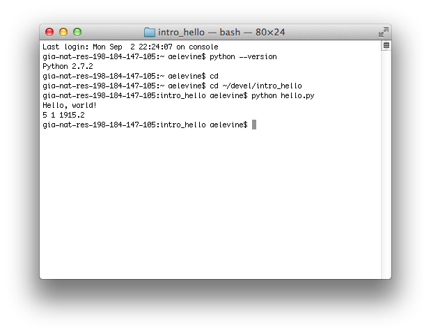

# Introduction

Welcome to the Software Craftsmanship Python examples. These examples will
lead you through a variety of programming exercises in conjunction with the main
Software Craftsmanship lessons. Programming is a skill, and like any other skill,
it takes practice to become truly proficient. The exercises in these examples range
from "monkey-see-monkey-do" problems getting you used to typing exactly as a
computer expects, to free-ranging ideas on programs you might be interested in
writing for yourself. 

You will want to complete every "MSMD" section exactly as written. Computers
are not forgiving when it comes to what you type in your program, and these
exercises are a safe way to begin exploring the world of computer programming.
The exercises for each chapter build on the MSMD section, and are opportunities
for you to apply what you've learned conceptually to a program. You should make
an attempt to complete all the exercises. Finally, projects are larger scale
ideas for programs that you would be able to write with the tools presented by
that point in the main text. The more you program, the better a programmer
you'll be, but you'll probably want to pick and choose projects that interest
you.

## python

In this book, we'll be using Python 3. It is included with many Linux distributions,
but if you are using macOS (OSX) or Windows, you will need to install it. 
On Windows and Mac, you will need to [download](http://www.python.org/download/) and run
[the windows installer](https://www.python.org/ftp/python/3.7.7/python-3.7.7-amd64-webinstall.exe)
or [the mac osx installer](https://www.python.org/ftp/python/3.7.7/python-3.7.7-macosx10.9.pkg)
respectively. If it is not installed by default with your linux distribution, follow
[the python documentation](https://docs.python.org/3/using/unix.html) for getting an up
to date copy.

## First Program

### Editor

An editor is a program you'll use to write the source code of your programs.
It's different from a word processor in that only the characters you type go
into the program file. For instance, a word program will have information about
what is a heading, where the tab stops are, and where any tables might be. In
contrast, the text editor only saves the actual letters and tab you'd type. Any
formatting or coloring you see is added after-the-fact, and is not part of the
original source code.

There are numerous code editors available, ranging from free to hundreds of
dollars, and from having almost no features to being able to write significant
portions of your source code and manage large pieces of your program for you. We
are going to choose a free editor with many nice features, but one that still
makes you handle most of the programming yourself. Managing your project on your
own will help you be a better programmer later.

We'll use [Visual Studio Code](https://code.visualstudio.com) as our text editor.
It is well supported, has a tremendously rich feature set and ecosystem of
extensions, and best of all, is completely free. When you visit the VSCode page,
it should suggest an appropriate download link for your platform.

*Why can't I just use TextEdit on a mac or Notepad on Windows?* You could, but
neither of those programs have any tools to help you program. Most importantly,
neight has syntax highlighting. Visual Studio Code will color different parts of
your code neatly, allowing you to see at a glance important pieces of your program,
and often allows you to catch typing mistakes before you even run the program. It
also has numerous language integrations, from running code to suggesting likely
completions as you type.

When VSCode is first opened, you will need to make a new project.

Create a new folder, creat a file in the folder, name it `hello.py`. Type this into
the file and save:

```
print("Hello, world!")
print(2 + 3, 10/7, 152 * 12.6)
```

Use VSCode to execute in the terminal.

### Terminal

Throughout the book, we will be using an editor and a command prompt almost
exclusively to write and run our programs. A simple command prompt and text
editor offer numerous advantages over other programming setups like
Integrated Development Environments (IDEs) and visual programming tools. All
the reasons stem from the fact that the command prompt is much closer to the
code than any of the other tools allow. While many common operations are
streamlined, knowing how to use the command line effectively is crucial to
overcoming many of the common problems you will encounter in the course of
your programming.

#### VSCode

Visual Studio Code has a built-in terminal pane that opens on-demand below
your code. It uses the default terminal for your system, so read through the
appropriate section below, and remember that you will always have this
available right inside VSCode.

### Running the program

In Visual Studio Code, you can quickly and easily run a program in the built-in
terminal by right-clicking the file and selecting "Run Python File in Terminal".

And you should see the output

```
Hello, world!
5 1 1915.2
```

Congratulations! You've written your first program!



### Oh no! Something went wrong!

#### Selecting a Python Version

When you run a python file, VSCode will open the terminal below your code,
and execute the python file using the currently selected python version. VSCode
may choose to use python 2, which will cause problems with some programs we
run. To fix this, right-click the editor window, select "Command Pallette"
at the bottom of the list, type "Python: Select Interpreter" from the command
list, and choose a Python 3 version.

#### Anything Else

This is a lot of new activity for many readers, and it's ok if something went
wrong. I'll go through the most common issues here. Keep this page handy,
because even if you don't have any of these problems this time, they may
accidentally come up again later.

*Early readers: Please send me a message with any problems you have, so I can
include them here.*

## Exercises

1. **Say more things** Make your program say
	1. "Time for Breakfast!"
	1. "Goodnight, world."
	1. "Programming is fun!"
1. **Say even more things!** Make your program say another five things.
1. **Say some math.** Make your program say the results of more mathematical
	expressions. We'll cover arithmetic more in the next chapter.
1. **Try Visual Studio Code** [Visual Studio Code](https://code.visualstudio.com/)
        is a very powerful editor with a number of extensions to make writing
	many programming languages easy.

When you've done some or all of these, get started in
[chapter 1](../../01_basic_types_and_control_flow/README.md)
