# The Unix Terminal

There is a world of confidence and power inside your computer, that you will
only discover when you begin learning the original tools people have been using
since the invention of the personal computer. Under the windows and webbrowser
and pretty graphics lives a world of text commands. In what would take a minute
to complete in Finder or Windows Explorer, I can do on the command line in 10
seconds (Moving some files, creating several folders). Something that would take
10 minutes could happen 10 or 20 seconds (renaming a half-dozen files). There
are still other things that are simply unexposed in a graphical format (changing
low-level system performance settings, editing every file in an entire folder
and all its subfolders at once, listing the name of every file in a folder and
its subdirectories that match some certain criteria (like having the phrase
'finalDraft' in the file's name).

## General Usage

*Terminal? Command Prompt? Which is it?* It's both. It's a command prompt because
it's a program that Prompts you for Commands. The command prompt itself is a
specific program on your computer - Unix usualy uses a program called "Bash" by
defaults. It's a Terminal because historically, the Terminal was at the end of a
connection to a phone line that the display and keyboard connected to the
mainframe over. Today, the terminal is the program that draws an actual window
on your desktop in which the command prompt runs and displays its output. The
command prompt is also sometimes called a shell. The three terms are used almost
interchangeably, and nearly lost all their nuance.

### OSX Specific 

In OSX, the first time through the book, we're going to use OSX' included
terminal program called, aptly, Terminal. It will run a shell called Bash. To
open it, find it either in the Utilities folder under the Applications folder in
Finder, or through Spotlight. It might also be a great program to pin to your
dock.

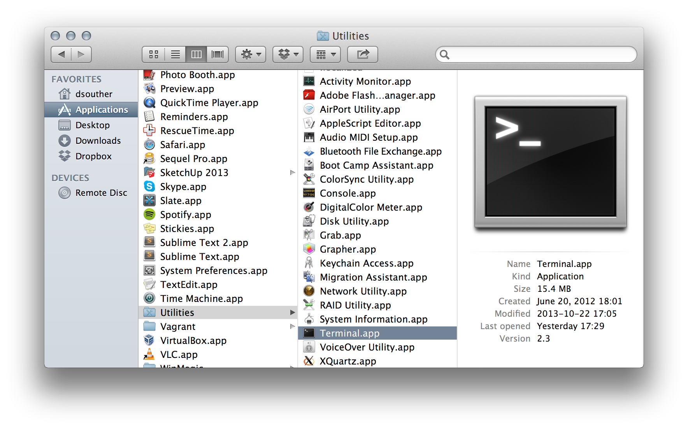

Terminal in a Finder window.

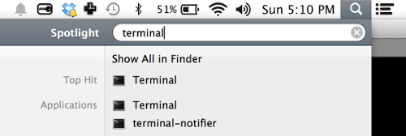

Terminal in Spotlight.

Once you've opened Terminal, you will see a mostly empty window.

Before we get any further, we're going to tweak this so it's much easier on the
eyes, and to work with in general. First, I would recommend expanding the window
with the plus, to take as much screen space as possible. Second, in settings,
choose a dark background color scheme. I personally like Pro - it colors well,
nothing conflicts badly, and it's easy on the eyes. Choose what you like best,
and click the "Default" button. Opacity is set at 85% on Pro, which means you
will be able to see through it a bit to the windows behind it. I don't like
this, so I set the opacity to 100%. It is also easier to program with a larger
font, I use Consolas at 18pt. It's easier to use a larger font for two reasons -
eyestrain goes down the larger the texts is, and fewer lines on the screen
encourages you implicitly to keep parts of your code smaller.

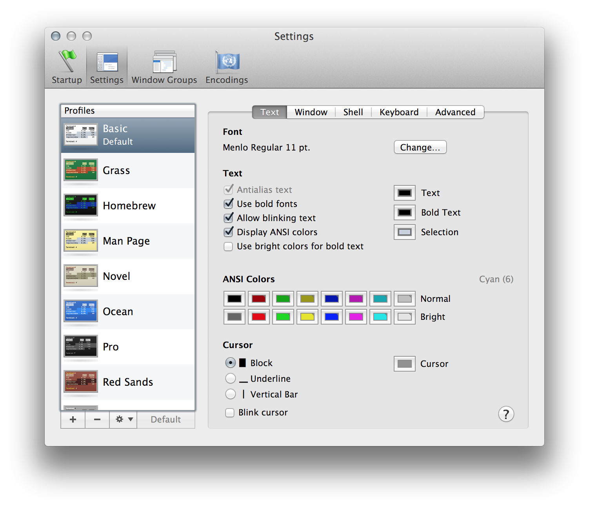

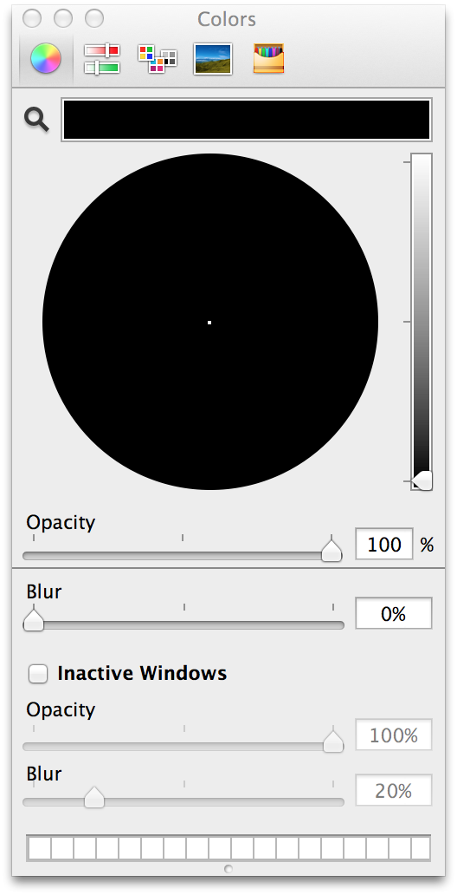

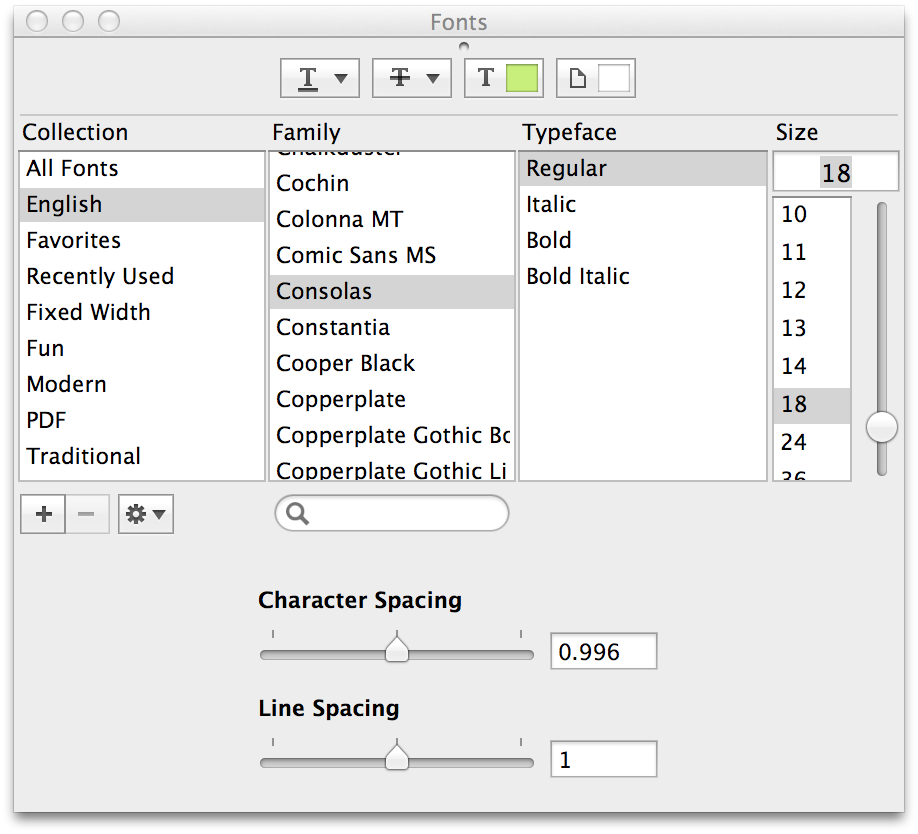

That covers the Terminal settings. Now we'll go and change some bash settings.
This is a little more indepth. Start by opening a file name `~/.bash_profile`
with gedit; the full command is `/Applications/

## File System

Now that the terminal has some reasonable settings, let's use it! The file
system is what you usually think about when you think of files and folders.
Since this is where all the computer's long-term data is stored, it's one of the
most common and basic things to work on in your computer. Nearly every thing you
do will involve in the file system in some way. Having a basic understanding of
the file system command will be your bread and butter throughout your future
Terminal experience.

### ls

The first command we'll use is called `ls`, short for 'List Directory Contents.'
It, with the other commands in this section, is one of the most commonly used
commands in the shell user's vocabulary. Try it once, and see what is in the
directory.

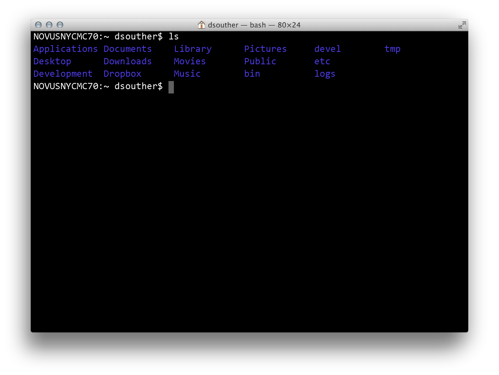

You see several files listed in several rows in dark blue (in the figure). These
are all folders. Files, in my shell, would be in white. We'll see that in a
moment.

There are three common variations on the `ls` command. The first is `ls -l`,
list directory contents with long formatting. Run this.

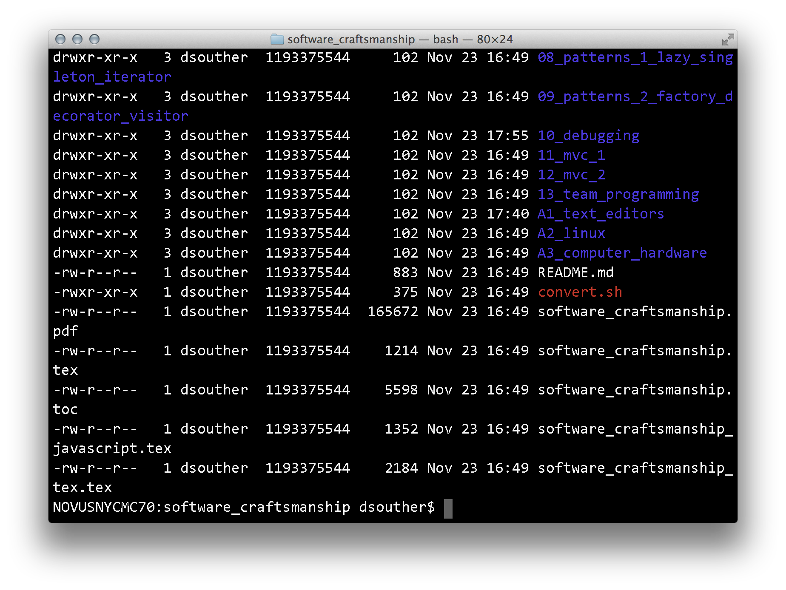

Here, you see the same files listed, but with much additional information. Most
shell users I know use this as their primary `ls` usage; I personally haven't
used bare `ls` in years until writing this book! The information in this listing
can be very intimidating when you first look at it. Luckily, for now, there are
only a few parts that you'll be using, all on the right side: the filesize, the
date, and the file name. The file name should be pretty clear. The date is the
most recent update time; for a folder, this is the last time a file anywhere
inside that folder was update. The file size means different things for files
and folders. Files, it is the exact number of bytes in the file. For a folder,
it is the number of bytes to track all the files one level deep within the
folder, and takes (on OSX) 68 bytes per file.

The next flag we'll look at is `ls -a`, list with all files.

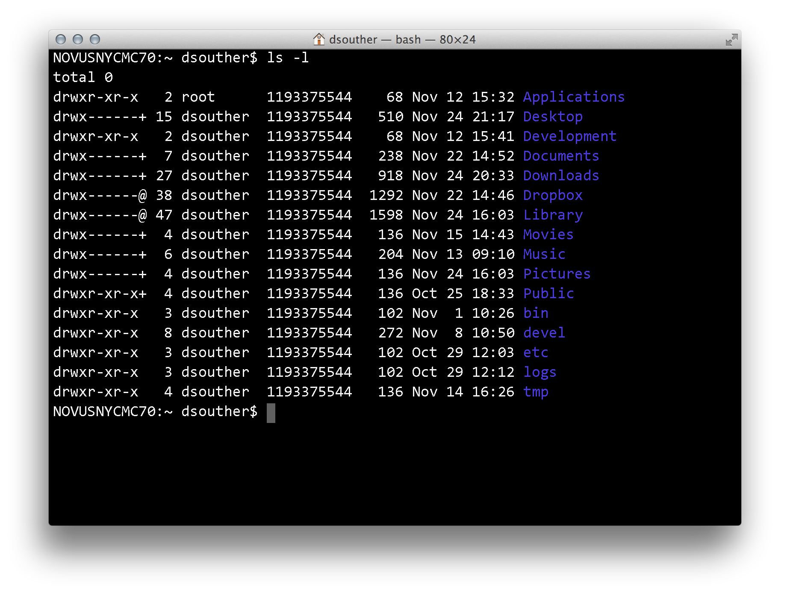

Here we see a file listing similar to the fist `ls` command, but with several
more files, each that starts with a  `.`. Unix has a convention that any file or
directory that starts with a `.` is a "hidden" file, something that users don't
need to worry about on a day-to-day basis. The `-a` flag tells `ls` to show them
in the output.

The last thing we're going to look at is combining the two flags, '-a' and '-l'.
The command is `ls -l -a`.

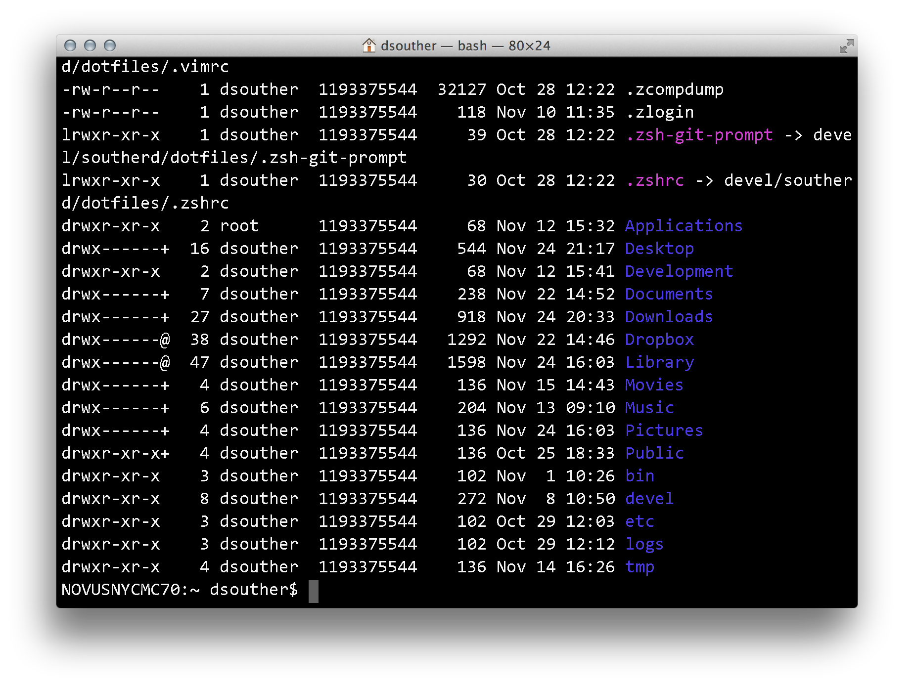

This has all the files in the directory, listed in long format. The `-l` and the
`-a` don't have to be in order, and in fact they don't have to be seperate - `ls
-l -a`, `ls -a -l`, `ls -la` and `ls -al` all produce the same output.

### cd

Seeing folders and files is neat, but now that we have them, how do we move
around? In the GUI, it's clicking and double clicking on an icon. On the command
line,  we use `cd`, Change Directory.

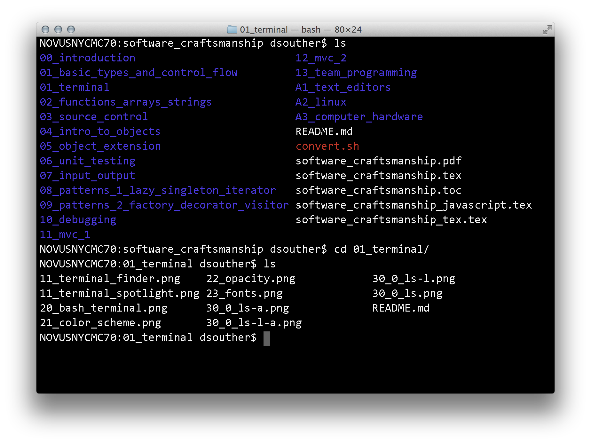

Here, I `ls` the directory, then move into my `Downloads` directory using `cd`.
If you know the directory structure, you can navigate arbitrarily deep by giving
a path with the directories separated by a slash. Again, from my home directory:

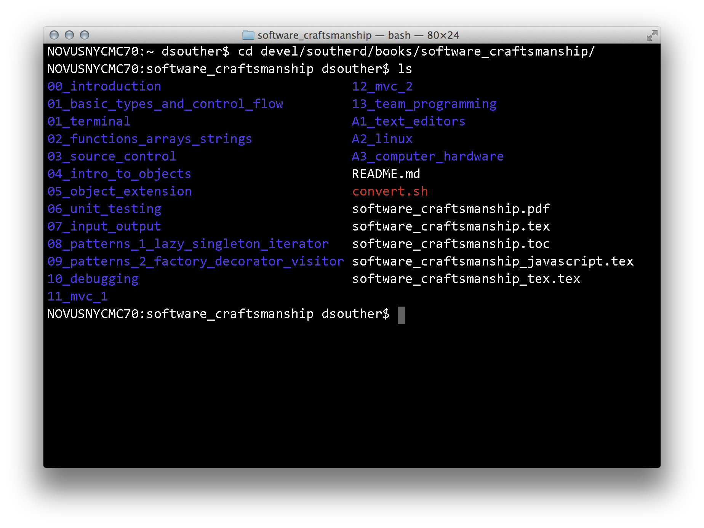

This gets you arbitrarily deep. To move back up the file system, use the special
folder `..`, which means 'the directory that is the parent to the current
directory'. It can be used anywhere in the path, and can also be deep. To get
back to my devel directory, I can use one `..` from the `software_craftsmanship`
folder.

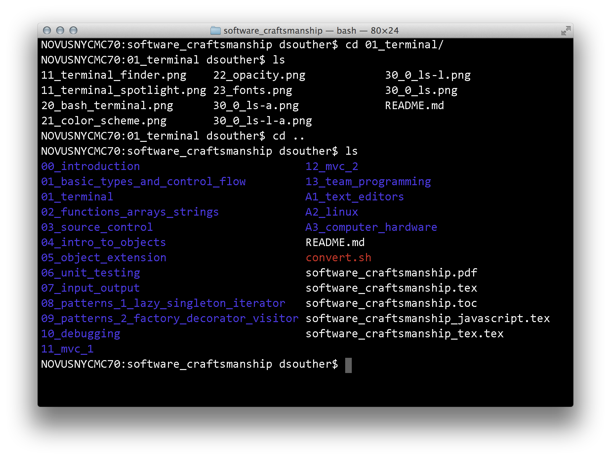

A very useful special folder is `~`, as a shorthand for your home directory. To
quickly get back to my Documents (from anywhere in the file system), use `~`.

Finally, to go back to the folder you were last in, use `-`.

### cwd

After moving around the file system, you may get a bit lost. Run the command
`cwd`, Current Working Directory, to print where you are in the file system.

### mkdir

Knowing what files and folders are already on your system is great, but what
about actual work, when you need to add to the file system? The first command is
for folders, `mkdir` for 'Make Directory'. Pass it any name, and it will create
a folder with that name inside the current directory.

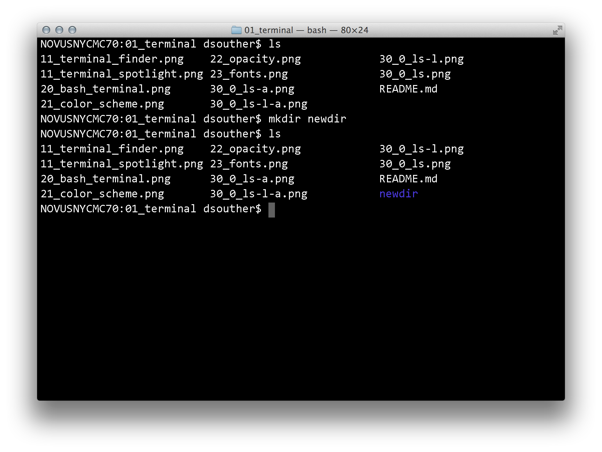

By default, `mkdir` can only create folders one level deep. Typing it with `-p`
(for 'parents') tells `mkdir` to create any intermediate directories it might
need.

### touch

`mkdir` creates folders, and `touch` creates files. (Actually, there are dozens
to hundreds of ways to create a file, `touch` happens to be one of the most
common.)

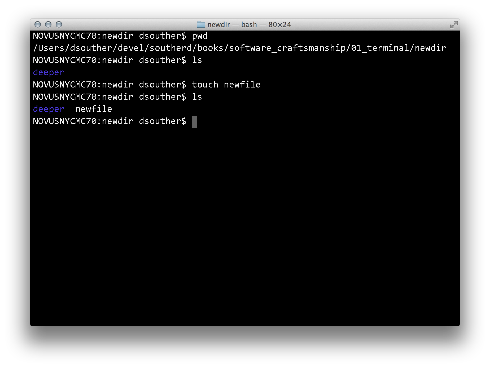

### rm

## Running Programs

### arguments

### Path

### ./

## Working with files

### less

### grep

### find

## Shortcuts

### tab completion
