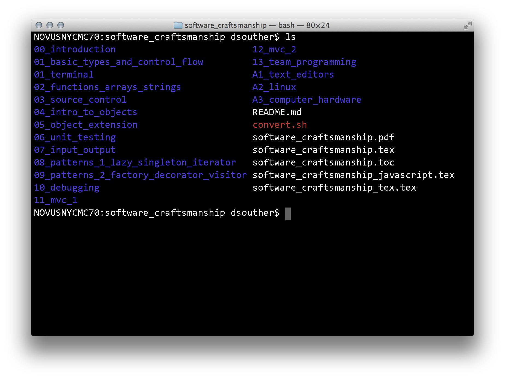
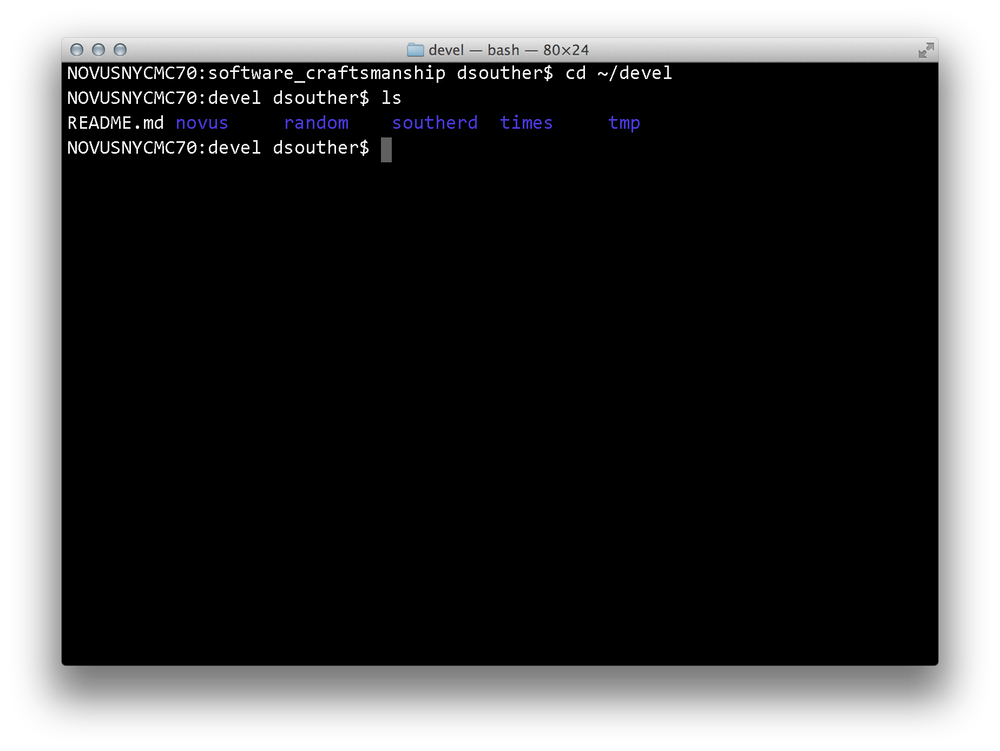
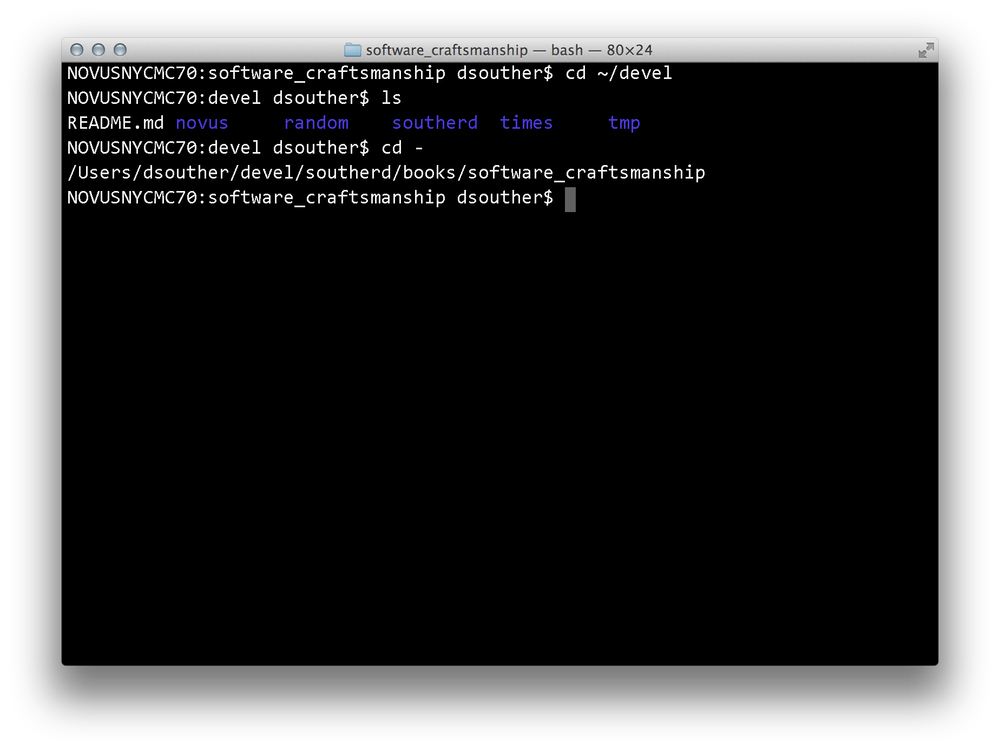
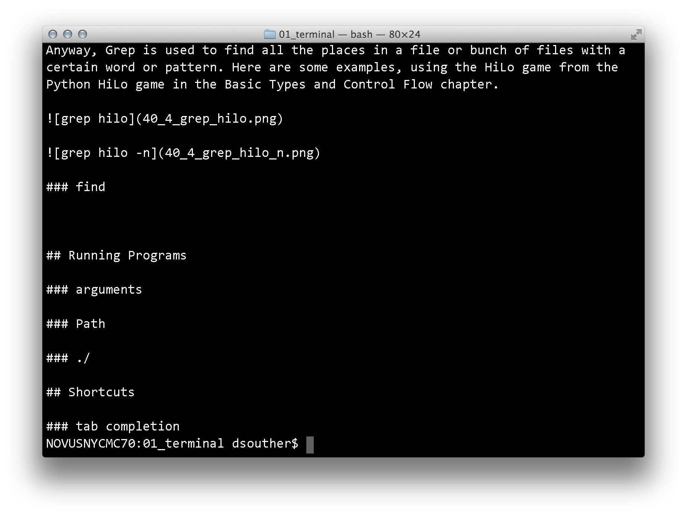

# The Unix Terminal

There is a world of confidence and power inside your computer, that you will
only discover when you begin learning the original tools people have been using
since the invention of the personal computer. Under the windows and webbrowser
and pretty graphics lives a world of text commands. In what would take a minute
to complete in Finder or Windows Explorer, I can do on the command line in 10
seconds (Moving some files, creating several folders). Something that would take
10 minutes could happen 10 or 20 seconds (renaming a half-dozen files). There
are still other things that are simply unexposed in a graphical format (changing
low-level system performance settings, editing every file in an entire folder
and all its subfolders at once, listing the name of every file in a folder and
its subdirectories that match some certain criteria (like having the phrase
'finalDraft' in the file's name).


## General Usage

*Terminal? Command Prompt? Which is it?* It's both. It's a command prompt because
it's a program that Prompts you for Commands. The command prompt itself is a
specific program on your computer - Unix usualy uses a program called "Bash" by
defaults. It's a Terminal because historically, the Terminal was at the end of a
connection to a phone line that the display and keyboard connected to the
mainframe over. Today, the terminal is the program that draws an actual window
on your desktop in which the command prompt runs and displays its output. The
command prompt is also sometimes called a shell. The three terms are used almost
interchangeably, and nearly lost all their nuance.

### OSX Specific 

In OSX, the first time through the book, we're going to use OSX' included
terminal program called, aptly, Terminal. It will run a shell called Bash. To
open it, find it either in the Utilities folder under the Applications folder in
Finder, or through Spotlight. It might also be a great program to pin to your
dock.


Terminal in a Finder window.


Terminal in Spotlight.

Once you've opened Terminal, you will see a mostly empty window.


Before we get any further, we're going to tweak this so it's much easier on the
eyes, and to work with in general. First, I would recommend expanding the window
with the plus, to take as much screen space as possible. Next, we'll change the
color scheme. To edit the color scheme, click "Terminal -> Preferences" in the
top bar, or press Command+P. 


I find it easier to program with a larger font; I use Consolas at 18pt. It's
easier to use a larger font for two reasons - eyestrain goes down the larger the
texts is, and fewer lines on the screen encourages you implicitly to keep parts
of your code smaller. You can change the font by clicking "Change" next to the
font display.


Choose the "Pro" color scheme on the left list. Opacity is set at 85% on Pro,
which means you will be able to see through it a bit to the windows behind it. I
don't like this, so I set the opacity to 100%. Go to the "Window" tab, then
click the black square beneath the "Background" label.


There is one last setting we need, and it's in bash itself. In the terminal
window, type this and hit enter:

```
echo export CLICOLOR=xterm-color >> ~/.bashrc
```

Restart terminal, and you're ready to go!

## File System

Now that the terminal has some reasonable settings, let's use it! The file
system is what you usually think about when you think of files and folders.
Since this is where all the computer's long-term data is stored, it's one of the
most common and basic things to work on in your computer. Nearly every thing you
do will involve in the file system in some way. Having a basic understanding of
the file system command will be your bread and butter throughout your future
Terminal experience.

A quick note: all the commands here are lower-case in the heading, so this next
commend is little-l little-s

### ls

The first command we'll use is called `ls`, short for 'List Directory Contents.'
It, with the other commands in this section, is one of the most commonly used
commands in the shell user's vocabulary. Try it once, and see what is in the
directory.



You see several files listed in several rows in dark blue (in the figure). These
are all folders. Files, in my shell, would be in white. We'll see that in a
moment.

There are three common variations on the `ls` command. The first is `ls -l`,
list directory contents with long formatting. Run this.


Here, you see the same files listed, but with much additional information. Most
shell users I know use this as their primary `ls` usage; I personally haven't
used bare `ls` in years until writing this book! The information in this listing
can be very intimidating when you first look at it. Luckily, for now, there are
only a few parts that you'll be using, all on the right side: the filesize, the
date, and the file name. The file name should be pretty clear. The date is the
most recent update time; for a folder, this is the last time a file anywhere
inside that folder was update. The file size means different things for files
and folders. Files, it is the exact number of bytes in the file. For a folder,
it is the number of bytes to track all the files one level deep within the
folder, and takes (on OSX) 68 bytes per file.

The next flag we'll look at is `ls -a`, list with all files.


Here we see a file listing similar to the fist `ls` command, but with several
more files, each that starts with a  `.`. Unix has a convention that any file or
directory that starts with a `.` is a "hidden" file, something that users don't
need to worry about on a day-to-day basis. The `-a` flag tells `ls` to show them
in the output.

The last thing we're going to look at is combining the two flags, '-a' and '-l'.
The command is `ls -l -a`.


This has all the files in the directory, listed in long format. The `-l` and the
`-a` don't have to be in order, and in fact they don't have to be seperate - `ls
-l -a`, `ls -a -l`, `ls -la` and `ls -al` all produce the same output.

### cd

Seeing folders and files is neat, but now that we have them, how do we move
around? In the GUI, it's clicking and double clicking on an icon. On the command
line,  we use `cd`, Change Directory.


Here, I `ls` the directory, then move into my `Downloads` directory using `cd`.
If you know the directory structure, you can navigate arbitrarily deep by giving
a path with the directories separated by a slash. Again, from my home directory:


This gets you arbitrarily deep. To move back up the file system, use the special
folder `..`, which means 'the directory that is the parent to the current
directory'. It can be used anywhere in the path, and can also be deep. To get
back to my devel directory, I can use one `..` from the `software_craftsmanship`
folder.


A very useful special folder is `~`, as a shorthand for your home directory. To
quickly get back to my Documents (from anywhere in the file system), use `~`.



Finally, to go back to the folder you were last in, use `-`.



### pwd

After moving around the file system, you may get a bit lost. Run the command
`pwd`, Print Working Directory, to print where you are in the file system.


### mkdir

Knowing what files and folders are already on your system is great, but what
about actual work, when you need to add to the file system? The first command is
for folders, `mkdir` for 'Make Directory'. Pass it any name, and it will create
a folder with that name inside the current directory.


By default, `mkdir` can only create folders one level deep. Typing it with `-p`
(for 'parents') tells `mkdir` to create any intermediate directories it might
need.


### touch

`mkdir` creates folders, and `touch` creates files. (Actually, there are dozens
to hundreds of ways to create a file, `touch` happens to be one of the most
common.)


### rm

When finished with a file (or, I do this a lot, after creating a file with the
wrong name), the `rm`, 'remove' command comes in handy.


It also works with folders, using the `-r` flag.


### mv

Besides creating and deleting files, it is also useful to move them around. In a
GUI, this is usually done by dragging and dropping between folders. In the shell
we use the `mv` command to move files. There are no commonly used flags for mv.


Notice you can either move to rename a file, or you can mv a file to a different
directory.

### cp

Moving a file literally moves it, and it is no longer at the original location.
Copying a file with `cp` is what you want when you need the contents of a file
or directory, while maintaining the original.


Like `rm`, `cp` can also take the `-r` flag to work on directories.


## Working with files

Now that we understand the basics of the file system, it's time to work with the
files we have and made.

### cat

It's much easier to work with files when we can read their contents. The `cat`
command prints the contents of the file to the terminal.




The second example runs cat on README.md (this file you're reading). There is...
quite a lot of text missing!

### less

For longer files, `cat` will overflow your screen with text. Instead, the
`less` command is a "pager" that prints a limited amount on the screen at a
time. Notice how the last line has the file name.


Less has several keyboard commands to control its operation. To move up and down
in a file, use the keys `j` and `l`, repectively. Press the spacebar to move
down an entire page. To search for a word or phrase, press the `/` key and start
typing - less immediately jumps forward to the next match as you type. When you
look for longer phrases, you'll find that saves you a fair amount of time. Once
you've found a match, press `n` to jump to the next mach, `N` to jump to the
previous match, or press the escape key to return to your original position. The
`h` key shows the help menu (again, press the Escape key to exit). Finally, when
you're finished with the file, press `q` to exit.

You will want to keep these key commands in mind - there are several programs in
the Unix shell that will use less to show you results, but might not tell you
what they've done, so noticing you're in a pager is a good skill to have.

### glob

Glob isn't a program, but somthing you can type when entering file or folder
names in a command. There are many possible glob patterns, but the one that's
used regularly is `*`, meaning to match zero or more characters.


### grep

*Grep and find are advanced programs. While being incredibly powerful, that
power comes with a lot of configuration. If this is the first time reading the
book, I'd recommend glancing at this section, seeing some of the minimum they
can do, and continue the book being aware they exist. Later, come back and read
more about them when you've come across some of the problems in programming that
these tools are build to solve.*

Grep is the file pattern searcher. To me it looks like it should actually be an
acronym. As I was writing this chapter, I decided to figure out what it stood
for. I was only mildly successful. There is no published direct history that
I've found, so I got to play with the acronym in my head. It looks like it's
named after a command from the program ed (beware ye who enter here). I *think*
it's for Global Regular Expression Printer, but I'm not sure. I emailed the
creator of the program, Ken Thompson, and asked. TODO PUT REPLY? The point of
the aside is: I think it's pretty awesome that the original creators of the
tools we use today are still alive and contributing to this field. That's pretty
cool!

Anyway, Grep is used to find all the places in a file or bunch of files with a
certain word or pattern. Here are some examples, using the HiLo game from the
Python HiLo game in the Basic Types and Control Flow chapter.


### find


## Running Programs

### arguments

### Path

### ./

## Shortcuts

### tab completion
