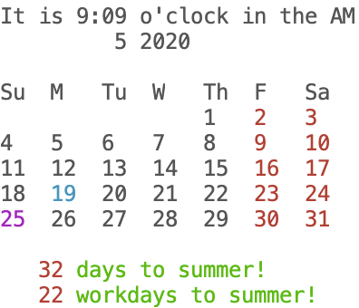

# Objects and properties

In most of our Python up to this point, we've been using single variables to
refer to single values. We have one variable that refers to an `area`, which we
know to keep in mind as an area of a rug based on context. We have one variable
`n` which we set to `len(my_array)` to track the size of an array. We have one
single variable that we set a couple times to hold the perimeter cost of a rug.

If we didn't have scopes, this would be ridiculous - every different function
that wanted to talk about an `area`  would need to come up with a unique name for its variable!
Whether its rugs or the size of a floor in your house, you'd end up with something
like `area_rug_when_computing_cost` and `area_rug_from_user_input`! Scopes at
least let us have one `area` within the function `rug_cost`, and we can know by
context what it's being used for.

But keeping all these variables on their own is kind of a pain - a rug doesn't
just have an `area`, it also has a `perimeter` and a `side_length`. In the
programs in this chapter, we're going to learn about another way to group bits
of relevant data - **objects**.

Objects are bundles of values that are all related to one another in some
contextual way. For the rug, an object would keep track of all the values for
its side length, whether it has fringe, its area and perimeter and cost, and
whatever else we need to access from it. Once we put a rug object together, we
can have one variable `rug` and get all those values from it.

We structure the object using **properties**. Properties are variables that are
tied to a single object. Just like a variable, they have an *identifier* and a
*value*. Unlike variables, they aren't bound to a scope, but rather are stored
with an object. Just like variables, their values can be whatever is needed --
a number, a string, an array, or even another object!

Before we go back to our rugs example, we're going to work with a built-in
object type first, `datetime`.

## Dates

In computer programming, handling dates can get complicated. Unlike numbers,
dates have dozens of rules controlling how a date is handled. From different
numbers of days in months, to leap years, to "11th" compared to "21st", dates
require much special handling from computer programmers.

In Python, the basic date handling is in a module called datetime. We're going
to start by actually grabbing two items from it, `datetime` and `timedelta`
which we'll explain in-depth later. (While we're here, we'll also grab our
trusty [`colors.py`](./colors.py) - download it again or copy it if you are in a
new folder).

Make a new file, `calendar.py`, and let's get going!

```python
import colors
from datetime import datetime, timedelta
from time import sleep
```

These lines allow us to use `datetime` later in the program. It's similar to
`math` from chapter 1. For us, we want the function `datetime.now()`, which gives
us a "date" thing, seperate from an integer, float, or string, that allows us to
check the month, day, and year.

A `datetime` is an object with properties for each of the things you might
expect - `hour` gives us the numerical hour in the day that that datetime
represents; `month` the month of the year, `microsecond` the number of
millionths of a second the datetime was created at.

When we have a single `datetime`, these values don't change unless we tell it
to! When we used the function `datetime.now()`, it looked at the computer's clock
*at that moment in time*, made a note of it, and that moment *at a point in time*
is what we can look at. If we want a different `datetime`, we have to call `datetime.now()`
*another time*, and this time we get back a *different* datetime! It doesn't
update the one that we had gotten before. Let's see what that looks like.

```py
moment_1 = datetime.now()
sleep(0.5)
moment_2 = datetime.now()
sleep(1.5)
moment_3 = datetime.now()

print(moment_1.hour, moment_1.minute, moment_1.second, moment_1.microsecond)
print(moment_2.hour, moment_2.minute, moment_2.second, moment_2.microsecond)
print(moment_3.hour, moment_3.minute, moment_3.second, moment_3.microsecond)
```

Running that at a little before 3 pm I got this output:

```
14 48 36 731726
14 48 37 235577
14 48 38 736215
```

You should have something similar - the second one is about .5 seconds after the
first, and the third is about 2 second after the first!

> `datetime` tracks hours using 24 hours in a day. Later in this section, we'll
see how to get AM/PM hours.

### Desktop Calendar

Before we dive in to the rest of this program, let's take a look at what it'll
show us. It's going to be a program that prints a calendar of the current month.
The days of the week will be along the top, with weekends a different color.
It will also mark today a specific color, as well as any holidays we have this
month. At the bottom, it will print the number of days as well as the number of
workdays until the next holiday, and finally it'll have a digital clock printing
the time in H:M format.

It will look like this when we're done:



Let's take a look at a function that returns the string for which month of
the year a date is. Remove everything but the imports above, and add this
instead. The `def` keyword starts starts *def*ining a section of code. The
parenthesese tell python it is a function, while `month` gives it a name.
Finally, `date` names an argument for the function. This will take a
`datetime` object, not just a number!

```python
def month(date):
    if date.month == 1:
        return "January"
    elif date.month == 2:
        return "February"
    # 10 more cases for you to write out
 
print(month(datetime.now()))
```

Running that this morning, it told me it was `May` as expected!

In this function, we have the argument date. We expect callers to pass a
datetime as the argument. One property of a datetime is `month`, which gives us
the numeric month of the year starting from 1 as January. We access a property
on an object using a `.`. So `date.month` says go to the value in the variable
`date`, find its property `month`, and use *that* value for our expression.

At this point, we can do the top bar of our calendar. Replace the print line
with this bit of code.

```python
moment = datetime.now()
month_face = f"{moment.day} {month(moment)} {moment.year}"
print(f"{month_face:^28}")
```

And running that, we see

```
        19 May 2020        
```

Let's look at this bit by bit. We get a single moment, so that we can use that
one moment in time several times, once to get the day, once for the month, and
once for the year. We get the `day` as a property of `moment` using `.day`, and
the same for `.year`. We use the `month` function we just wrote to get the full
name of the month, rather than the number.

We start a new variable, `month_face`. This is so we can easily center it, on
the next line. We build it by using a **template string** which we introduced
in the strings section last chapter. We know it's a format string because it
has an `f` right in front of it. It accesses two different properties on the
object returned by the `no` function (which, again, is a datetime) -- `day` and
`year`. It also takes the entire object and passes it to our `month` function we
just wrote above.

We store this in the variable `month_face` so that we can use a second format
string to center the text we just created. We do this with the `:^` format
specifier. In chapter 2, we used `:.2f` to specify the amount of precision we
wanted in a floating point number. In the format string, the `:` marks where
the variable ends, and when modifiers to the formatting begin. There are
three that are useful when working with text, and those are `:<`, `:^`, and
`:>`. All three take a number after the arrow, and they fill out the text
with extra spaces on the sides so that the final string has many characters
(including spaces) as the number specifies. The text is padded with
whitespace after, around, or before the value it got from the left of the
`:`. That is to say, these all let us left, center, and right justify a
string of text. In this case, we use 28 characters because that's how wide
our calendar will be.

### Calendar Days

Let's start to build out the calendar days part of the program. We're going to
do it in stages, starting simple and adding to it as we go. We still want to get
a plan of action before we start.

Thinking through what the calendar should look like, it should have 7 columns,
one for each day of the week. It will have 4 to 6 rows, depending on how many
weeks the month takes up. Each day in the month, then, will end up having a
column, based on which day of the week it is. It will also have a row -- but the
row its in will depend on how many weeks have come before it at that point. In
a python date, the `weekday()` function will give us a number between 0 and 6 --
0 means Monday, 1 means Tuesday, up to 6 being Sunday. So if this gives us the
column to put the day in, what about the row?

For the row, we can just keep track of what row we're currently in, and
increment it by one each time we get to a Sunday. With this plan, we need to do
a couple things. We need to loop through all the days in a single month,
tracking which week of the month ourselves and increasing it every time we get
to a sunday. Then for each day in the month, we need to print it out using the
weekday and week of the month to choose a row and column to print it in. Two
separate things to do means two separate functions! Let's write ourselves a
`print_day` function first, which takes a `datetime` and week to print it in.

```python
def print_day(date, row):
    column = 2 + 4 * date.weekday()
    print(colors.at(row, column), end="")
    print(date.day)

print_day(datetime.now(), 1)
```

For me, on Tuesday the 19th, I see a few spaces and then `19`.

```
     19
```

`date.weekday()` is a function which will return the weekday (0 is Monday, 6
is Sunday) for the date it's attached to. For our calendar, we want each
weekday to take up 4 spaces, so that's why we multiply by 4 - to skip past
the other earlier days that week. The `2 +` is just an initial padding to not
squish everything up against the left side of the screen. With that row and
column, we print `colors.at()` to move the cursor, but we also add this new
piece `end=""`. Usually when we print, it moves the cursor down to the next
line immediately. We don't want that to happen, and suppress that behavior
using `end=""`.

> The reason it's called `end` is because normally, python uses the special
string `"\n"` to mean "New line", and inserts it automatically at the end of
every print string. You can think of it as every time you print, you are really
doing `print(my_string, end="\n")`. Because 9 times out of 10 this is the
behavior we want, it's much easier to do it by default instead of requiring
every time we use print to include it. This is the escape hatch for when we
don't want the default.

### Calendar Weeks

Now that we can print one day, let's do the `print_month` function which will
print an entire month for us. Delete the `print_day` testing line, and then add
& test this `print_month` function.

```py
one_day = timedelta(1)
def print_month(date, first_week_row):
    day_in_month = datetime(date.year, date.month, 1)
    week = 0
    while day_in_month.month == date.month:
        print_day(day_in_month, first_week_row + week)
        if day_in_month.weekday() == 6:
            week += 1
        day_in_month += one_day

print(colors.CLEAR)
print_month(datetime.now(), 2)
```

There's a bit more to this one, as we might expect when we need a loop. The
function declaration looks about the same as for `print_day` - a `date` to
tell us which month we're interested in, and `first_week_row` which we will
use to know how far down the page to print the month part of the calendar.
The loop will track `day_in_month`. Each iteration of the loop, we add one
day to it, and keep looping until the tracking variable is no longer in the
same month as the original `date`. Each time through, we also track the
current week within the month, incrementing it after printing each Sunday.

Above that, though, we have a constant - `one_day = timedelta(1)`. What do you
think that is?

Where a `datetime` tells us a specific point in time, `timedelta` describes the
amount of time between two points in time. There are two ways to make a
`timedelta`. The first is to subtract one date from another. (No need to type
this next example yourself.)

```py
time_then = datetime.now()
sleep(10)
time_now = datetime.now()
time_difference =time_then - time_now
print(time_difference)
```

Prints out

```
0:00:10.001196
```

Which tells us it took 10 seconds and some change between those two datetimes we
created!

Once we have a timedelta, we can go the other way around.

```py
print(time_now)
print(time_now + time_difference)
```

```
2020-05-20 08:08:59.351762
2020-05-20 08:09:09.352958
```

That works great for things like "How long until Christmas Day?" by creating a
datetime for the holiday, and subtracting today. We're going to use it a bit
differently, by creating a datetime and timedelta directly from the calendar day
we're trying to print out.

Quick recap of that: we have the date that we want to use to print a calendar
for the surrounding month. The caller of the printMonth function provides that.
In the printMonth function, we want to make a new datetime that corresponds to
the first day of the month. Then, we want to print that day (not the one the
user provided), and loop through all the days in the month. We get the next date
in the month by creating a timedelta which represents the concept of one day,
and then add that to the date representing the start of the month.

That bit alone looks like this:

```python
one_day = timedelta(1)
def print_month(date):
    monthly = datetime(date.year, date.month, 1)
    while monthly.month == date.month:
        print(monthly.day)
        monthly += one_day
```

Running this with `print_month(datetime.now())`, I get this output:

```
1
2
3
4
... 25 more lines...
30
31
```

So we have `one_day` which is the `timedelta(1)` to represent a single day. That
is defined at the file level - we'll just use the same one every time we call
the function. We need a new datetime that represents the beginning of the month,
because the provided `date` variable is going to be any arbitrary point of time
within a month. We get that instance of the beginning of the month by creating
a new `datetime` with the same year and month as the one we're given, but then
we set the `day` to `1` (the 1st), and don't provide any values for the hours,
minutes, or seconds. This is the `datetime` which represents the point in time
at midnight of the first day of the month that our input date is in.

We're going to take this datetime object, and keep adding one day to it. As long
as it's still inside the month we started with, we'll print it out. The
`datetime` will handle the logic itself for knowing how many days to use. We
just need to look at the `month` property every timearound.

Looking back at the first `print_month` function up above, we should now be able
to make sense of `week` and `first_row`. `first_row` is an argument used to tell
`print_month` how far down the page to start printing. `weeks` then tracks which
week of the month the loop is in, incrementing it whenever `monthly.weekday()`
is `6`, Sunday (incrementing *after* printing).

Run it again, and take some time to think through what we've just covered and
how it works together.

### Highlighting Days

Now that we have our calendar printing out, let's make it highlight each day
based on whether it's a weekday, a weekend, a holiday, or the current day. We
will do this by first writing a helper function for each of those cases, and
then by using those functions in the `print_date` function we already wrote.

```py
def is_weekend(date):
    # Monday is 0, Sunday is 6
    return date.weekday() > 4

HOLIDAYS = [
    datetime(2020, 1, 1), # New Year's Day
    datetime(2020, 1, 20), # MLK Jr
    datetime(2020, 2, 17), # George Washington's Birthday
    datetime(2020, 5, 25), # Memorial Day
    datetime(2020, 6, 3), # 4th of July Holiday
    datetime(2020, 9, 7), # Labor Day
    datetime(2020, 10, 12), # Columbus Day
    datetime(2020, 11, 11), # Veteran's Day
    datetime(2020, 11, 26), # Thanksgiving Day
    datetime(2020, 12, 25), # Christmas Day
]

def is_holiday(date):
    return datetime(date.year, date.month, date.day) in HOLIDAYS

def is_workday(date):
    return not is_weekend(date) and not is_holiday(date)

```

The first helper, `is_weekend`, is very easy. It just checks if the `weekday()`
is greater than 4 - remember, 0 is Monday and 5 is Saturday!

`is_holidays` does a couple tricks that are new to us. First, it uses a block of
data that explicitly lists out the days that are considered holidays. While we
could write functions to calculate most of these (Thanksgiving is on the third
Thursday of November; Christmas is the weekday closest to the 25th of December)
I think it's easier to just list them out. Besides, these holidays are only
correct for the US - by making it a block of data, we can just come along later
and change it to whatever days we need to for our locale. This type of data
driving programming is more common than you might expect!

The `is_holidays` function is then going to use the `in` operator to determine
whether a certain value appears in the array at all. `5 in range(1, 10)` would
return true, as would `"def" in "abcdefghi"`. But remember that a date is a
single point in time, so we normalize whatever date it is to be midnite exactly
of the date in question. This type of normalization is another very common
trick!

The last function, `is_workday`, almost reads like plain English. Workdays are
any day that aren't a weekend or a holiday. Maye we should add vaction days in
here as an exercise...

With these helpers in hand, we can expand our `print_day` function with some
color base on which of these conditions are true.

```py
def print_day(date, row):
    now = datetime.now()
    print(colors.at(row, 2 + (4 * date.weekday())), end="")
    if date.day == now.day:
        print(colors.YELLOW, end="")
    elif isHoliday(date):
        print(colors.PURPLE, end="")
    elif isWeekend(date):
        print(colors.RED, end="")
    else:
        print(colors.WHITE, end="")
    print(date.day)
```

Using this in place of our `print_day` before, and testing using the
`print_month` function, should get us pretty close to the output we demoed at
the beginning of the chapter! We just need to add a couple pieces of "pretty
printing" before calling `print_month`.

```py
def print_calendar():
    now = datetime.now()
    print(colors.CLEAR, colors.at(1, 1))
    print(" Su  M   Tu  W   Th  F   Sa")
    print_month(now, row=2)

print_calendar()
```

All we do here is grab the current datetime, clear the screen, and start writing
the calendar at the 4th row, first column. We add a row of the day of the week,
and then use `print_month` starting at row 6 to give us the days in the calendar
appropriately aligned. It should look like this, all said and done:

```
 Su  M   Tu  W   Th  F   Sa
                 1   2   3
 4   5   6   7   8   9   10
 11  12  13  14  15  16  17
 18  19  20  21  22  23  24
 25  26  27  28  29  30  31
 ```

 ## Recap

 In this section we looked at using two builtin Python objects, `datetime` and
 `timedelta`. An object is a programming tool to group related data together.
 Instead of having a bunch of variables that are near eachother and maybe have
 the same name, we instead create an **object** that keeps all those values in
 its **properties**. We can then use the single value of the object, rather than
 needing to specify each piece of it separately every time.

 Up next, we will look at how to create our own objects, when we [revisit the
 rugshop with classes](../02_rugs/README.md) 

 ## Exercises

*   **Vacations** Add vacation days and give them a color.
*   **Clock face** Look at more properties on dattime, and use them to print a
    clock face.
*   **Days until** Using timedeltas, count the number of days between two dates.
    Use this to print "Days until/Workdays until"
*   **Tick Tick Tick** Using loops and `time.sleep`, make your clock tick.